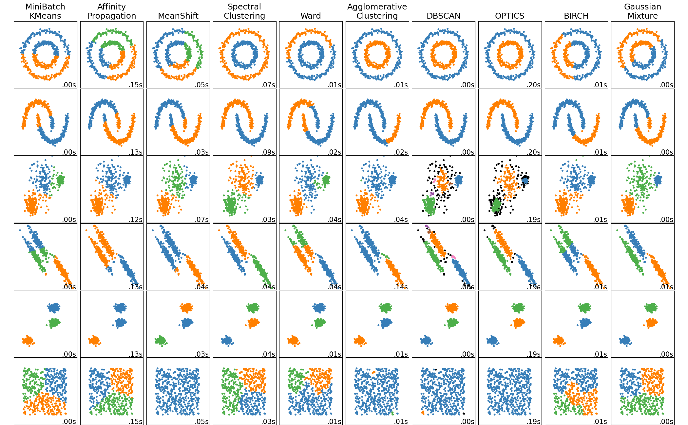
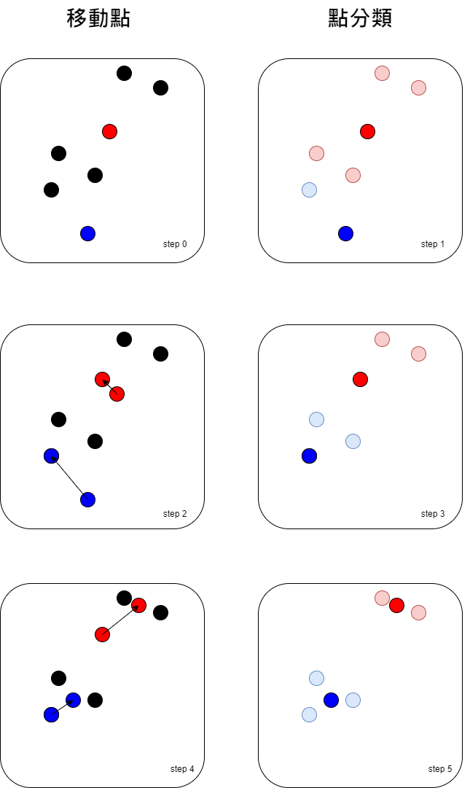

<script src="https://cdn.mathjax.org/mathjax/latest/MathJax.js?config=TeX-AMS-MML_HTMLorMML" type="text/javascript"></script>
<script type="text/x-mathjax-config">
MathJax.Hub.Config({
    tex2jax: {
    inlineMath: [ ["$","$"], ["\(","\)"] ],
    processEscapes: true
    }
});
</script>


# Introduce clustering

今天要介紹的分群 (clustering) 是無監督學習 (unsupervised learning)的方法，這種方法實在太好啦，我們來談談他到底好在哪

### 先有靶再射箭 : supervised learning

上到現在大家對於 supervised learning 的手法應該很了解了，要訓練模型需要 $X$ 與 $y$ ， 
$y$ 就是我們的靶，我們的目標，你如果有去工作過會發現，很多時候你可以收集到許多資料，
例如一堆照片，一堆影片(監視錄影機拍的)，或很多客戶表單資料，或是前人遺留珍貴紀錄檔，
但是唯獨缺的就是這些資料沒有意義，沒有目標，連公司主管或老闆其實都不知道要做什麼，
會跟你說你就看看這些資料你能分析出什麼，美其名曰"如果我跟你說要做什麼會限制你的表現，會讓你綁手綁腳"，
所以你要做 supervised learning 首先要面對的是意義與目的，我這邊分享一個我的真實經歷，
我某天在工作中老闆說要跟其他公司合作，今天下午去找OOXX談合作內容，我們的目標就是要合作5G大數據(為了保護當事人細節被和諧了)，
內容都想好了，你就去跟對方談好細節，
我就想說好吧看我能在這裡幫到什麼，然後下午兩方人馬互相乾鄧眼，都以為對方都規劃好，自己是輔助就好，看自己會什麼就提供什麼幫助就好，
原來兩方老闆都認為5G大數據很紅，未來發展淺力無限決定要做，好了兩方老闆都完事了，
對於產品、行銷、技術等等細節完全沒有，都以為對方會搞定，更有趣的是連資金都沒到位。

### 先射箭再畫靶 : unsupervised learning

如果今天有個工具是不需要你先給目標，他可以自己幫你預測，假設老闆跟你說，我們今年想推一新產品，或是有新的行銷企劃，
來這是之前顧客的資料，你來挑一些顧客來試試水溫，蛙阿你這時還不跳起來，難到要把公司之前的資料都看過再把人分類，
如果你還很白目地問老闆那要給誰先來試用看看，去IG、去FB貼文章收集有意願的人嗎，
老闆只會說廢物這種事還來問我，要是淺在客戶最近很忙沒看到怎麼辦，
這時候如果你先用今天要教的技巧分群 (clustering)，你先把顧客分個 5 群好了，再分別看這 5 群的資料有什麼顯著特性，
可以用年紀，收入等刻板印象去帶入，然後跟老闆報告，這次要行銷或要推的新產品，特別適合XX，我挑出了候選名單OOO人，
可以先試試水溫，你就可以等著進一步的資料分析。


下面先來看看不同算法的效果




# K-means

因為 K-means 很泛用，所以我們會先介紹 K-means，K-means 的參數要決定幾類(number of clusters)，可擴展性 ``n_samples`` 很大， ``n_clusters`` 中等。


下面我們實際看看 k-means 實際是如何執行分群的。

## steps

1. 決定 $k$，要決定要分幾群。 
2. 隨機選 $k$ 個點，下面的例子是取兩個點 藍點 跟紅點。
3. 把靠近藍點的點歸給藍色那一群，把靠近紅點的點歸給紅色那一群。
4. 算新的中心點。
5. 重複 3. 跟 4. 直到收斂。





下面進入實戰


```python 
# 做 Iris 的分群
from sklearn import datasets
from sklearn.model_selection import train_test_split
from sklearn.cluster import KMeans
import numpy as np

X, y = datasets.load_iris(return_X_y=True)

X_train, X_test, y_train, y_test = train_test_split(X, y, test_size=0.1, random_state=87) 


cluster_model = KMeans(n_clusters=3, random_state=87).fit(X_train)

print('True label:')

display(y_train)

print('cluster label:')

display(cluster_model.labels_)

print('Test True label:')

display(y_test)

print('Test cluster label:')

display(cluster_model.predict(X_test))
display(cluster_model.cluster_centers_)

```


```python 
# 拿來跟真實的標記比較
from itertools import permutations 
from sklearn.metrics import accuracy_score

perms = permutations([0, 1, 2]) 

for perm in list(perms): 
    y_train_pred = list(map(lambda x: perm[x] , cluster_model.labels_))
    y_test_pred  = list(map(lambda x: perm[x] , cluster_model.predict(X_test)))
    print(perm, ' accuracy train:', accuracy_score(y_train, y_train_pred), 'accuracy test:', accuracy_score(y_test, y_test_pred))

```


# n_clusters

我們在做 k-means 的時候，會發生不知道要分幾群的問題，這時候我們可以使用 inertias ，來當指標看要分幾群，inertia 是計算所有點到每群集中心距離的平方和。


```python 
# 看分幾群
from sklearn import datasets
from sklearn.model_selection import train_test_split
from sklearn.cluster import KMeans
import numpy as np
import matplotlib.pyplot as plt
%matplotlib inline
plt.rcParams['figure.figsize'] = [10, 10]


X, y = datasets.load_iris(return_X_y=True)

X_train, X_test, y_train, y_test = train_test_split(X, y, test_size=0.1, random_state=87) 

cluster_model_list = [KMeans(n_clusters=k, random_state=87).fit(X_train) for k in range(2,10)]

inertias = [model.inertia_ for model in cluster_model_list]

plt.plot(range(2,10), inertias)

```


```python 
# 拿來跟真實的標記比較
from itertools import permutations 
from sklearn.metrics import accuracy_score

acc_train_list = list()
acc_test_list  = list()

X, y = datasets.load_iris(return_X_y=True)

X_train, X_test, y_train, y_test = train_test_split(X, y, test_size=0.1, random_state=87) 

cluster_model_list = [KMeans(n_clusters=k, random_state=87).fit(X_train) for k in range(2,7)]


for k in range(2,7):
    perms = permutations(range(0,k)) 
    cluster_model = cluster_model_list[k-2]
    acc_train_max = 0
    acc_test_max  = 0
    for perm in list(perms): 
        y_train_pred = list(map(lambda x: perm[x] , cluster_model.labels_))
        y_test_pred  = list(map(lambda x: perm[x] , cluster_model.predict(X_test)))
        # print(perm, ' accuracy train:', accuracy_score(y_train, y_train_pred), 'accuracy test:', accuracy_score(y_test, y_test_pred))
        
        # 真實的標記比，紀錄最好的標記
        if accuracy_score(y_train, y_train_pred) > acc_train_max:
            acc_train_max = accuracy_score(y_train, y_train_pred)
            acc_test_max  = accuracy_score(y_test, y_test_pred)

    acc_train_list.append(acc_train_max)
    acc_test_list.append(acc_test_max)


```


```python 
import matplotlib.pyplot as plt
%matplotlib inline
plt.rcParams['figure.figsize'] = [10, 10]

plt.title('Iris Dataset')
plt.xlabel('n_clusters')
plt.ylabel('accuracy')

plt.plot(range(2,7), acc_train_list, 'b-', linewidth=2)
plt.plot(range(2,7), acc_test_list, 'g-', linewidth=2)

plt .show()

```


# Other Scores

我們之前用來比較的分數 accuracy 很明顯會跟怎麼標記有關，所以在做 clustering 的時候，需要跟怎麼給類別無關，只跟怎麼分群有關的分數。

## rand_score

下面示範 rand_score 怎麼用，更多的 Clustering 的評價指標，請參考評價指標。


```python 
from sklearn.metrics import rand_score

labels_true = [0, 0, 0, 1, 1, 1]
labels_pred = [0, 0, 1, 1, 2, 2]

display(rand_score(labels_true, labels_pred))

labels_pred = [1, 1, 0, 0, 3, 3]

display(rand_score(labels_true, labels_pred))

```


```python 
# 看分幾群
from sklearn import datasets
from sklearn.model_selection import train_test_split
from sklearn.cluster import KMeans
from sklearn.metrics import rand_score
import numpy as np
import matplotlib.pyplot as plt
%matplotlib inline
plt.rcParams['figure.figsize'] = [10, 10]

X, y = datasets.load_iris(return_X_y=True)

X_train, X_test, y_train, y_test = train_test_split(X, y, test_size=0.1, random_state=87) 

cluster_model_list = [KMeans(n_clusters=k, random_state=87).fit(X_train) for k in range(2,10)]

score_train_list = [rand_score(y_train, model.labels_) for model in cluster_model_list]
score_test_list  = [rand_score(y_test, model.predict(X_test)) for model in cluster_model_list]

plt.title('Iris Dataset')
plt.xlabel('n_clusters')
plt.ylabel('rand_score')

plt.plot(range(2,10), score_train_list, 'b-', linewidth=2)
plt.plot(range(2,10), score_test_list, 'g-', linewidth=2)
plt .show()

```


看完這些方法，大家可以感受到，通常使用無監督的方法，效果都會比有監督的方法效果差。
