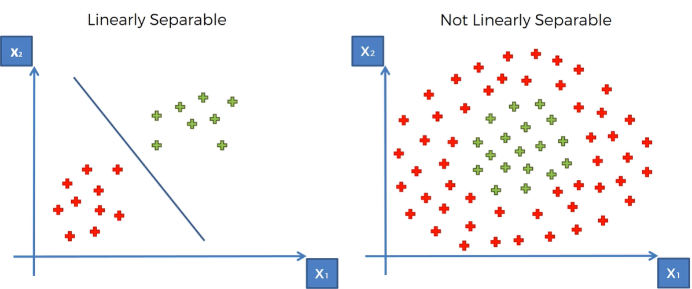
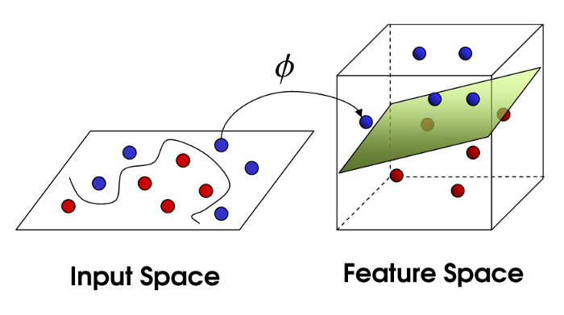

# Kernel Trick

我們前面已經知道 SVM 就是想要用刀把不同類型的資料一刀一刀切開，但是我們不可能天天過年，來看看下面右邊那張圖，我們要怎麼一刀把他們切開。





核函數的簡單想法就是如果我們不能在這個空間把他們切開來，那我們能不能設法在更高維度的空間把他們切開來。





# Kernel Definition

下面我們來說說他的定義，如果任意給定 $x,y \in X$，我們可以找到 $\phi$ 

$$
\phi : X \longrightarrow {\mathbb R}^N
$$

滿足

$$
k(x,y) = <\phi(x), \phi(y)>
$$

則 $k$ 是 kernel function 。 <br>

恩恩，上面到底在說什麼，實在太抽象了很難聽懂，好吧我們先忽略他，下面列出常見的 kernel function。


# Linear kernel

$$
k(x,y) =  <x,y>
$$

# Polynomial kernel

$d$ 是正整數，是多項式的 degree 

$$
k(x,y) = (<x,y> + c)^d, c \geq 0
$$

# Radial basis function kernel

$$
k(x,y) = \exp(-\frac{\| x-y \|_2^2}{2 \sigma^2})
$$

$\sigma$ 為非 0 實數。


# Kernel Ridge

我們下面提 Kernel Ridge 的使用方法， kernel 可以用的有 ``additive_chi2``, ``chi2``,
``linear``, ``poly``, ``polynomial``, ``rbf``, 
``laplacian``, ``Sigmoid``, ``cosine``。


```python 
import numpy as np
from sklearn import datasets
from sklearn.model_selection import train_test_split
from sklearn.kernel_ridge import KernelRidge
from sklearn.metrics import mean_squared_error


X, y = datasets.load_diabetes(return_X_y=True)
X_train, X_test, y_train, y_test = train_test_split(X, y, test_size=0.2, random_state=87)

# ['additive_chi2'，'chi2'，'linear'，'poly'，'polynomial'，'rbf'，'laplacian'，'Sigmoid'，'cosine']
regression = KernelRidge(alpha=1.0, kernel='linear')
#regression = KernelRidge(alpha=1.0, kernel='rbf')
regression.fit(X_train, y_train)


y_pred = regression.predict(X_test)
print("Mean squared error: %.2f" % mean_squared_error(y_test, y_pred))

```


```python 
??KernelRidge
```
