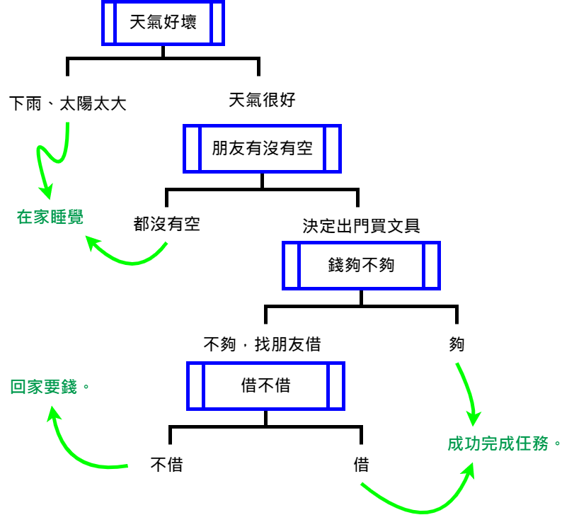
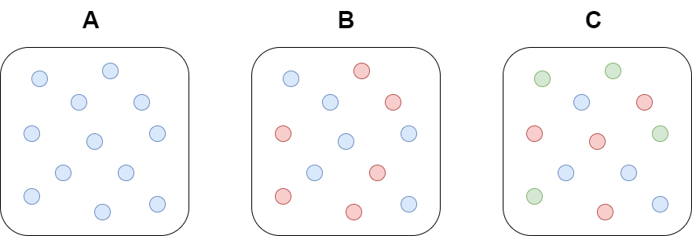

# Introduce

我們這次要介紹決策樹，決策樹其實對人類來說是最直覺最直觀的方法，我們來考慮一個情境題，
假設媽媽要你幫她去買文具，你開始思考如果外面天氣不好下雨或是太陽太大就在家休息，
然後你看到天氣不錯的那一天，你覺得自己一個人去買文具太無聊要拉個朋友，如果小美、小萌、小慧誰有空陪你去你就願意出門，
然後開始打電話，你約到小萌有空陪你去，到了賣場挑完原子筆、膠水、筆記本、釘書機等文具，你發現香水、指甲油等等你都想要買，
你發現蛙阿錢包裡的錢不夠，你跟小萌說我帶的錢不夠可以借我一點錢嗎?
小萌說不行這些她的錢要拿來裝可愛買娃娃的，你只好回家找媽媽要錢，媽媽就問你說你到底是怎麼做事的，
交辦這麼多天東西還沒買好，去做一份流程圖再來拿錢，你就把你的策略寫下來。


於是你畫下你的決策樹。


<details>
<summary> 手繪決策樹 </summary>



</details>


決策樹的想法是不是很直接與直觀，下面我們來看 Iris 資料集的決策樹的圖。


```python 
from sklearn.tree import plot_tree
from sklearn.datasets import load_iris
from sklearn.tree import DecisionTreeClassifier
import matplotlib.pyplot as plt
%matplotlib inline
plt.rcParams['figure.figsize'] = [10, 10]

iris = load_iris()

classifier = DecisionTreeClassifier().fit(iris.data, iris.target)

plt.figure()
plot_tree(classifier, filled=True)
plt.title("Decision tree trained on all the iris features")
plt.show()

```


下面來簡單驗證看看。


```python 

# 驗證看看
iris.target[iris.data[:,2] < 2.45]

```


如果換個參數，用 entropy。


```python 
from sklearn.tree import plot_tree
from sklearn.datasets import load_iris
from sklearn.tree import DecisionTreeClassifier
import matplotlib.pyplot as plt
%matplotlib inline
plt.rcParams['figure.figsize'] = [10, 10]

iris = load_iris()

classifier = DecisionTreeClassifier(criterion='entropy').fit(iris.data, iris.target)

plt.figure()
plot_tree(classifier, filled=True)
plt.title("Decision tree trained on all the iris features")
plt.show()

```


```python 
from scipy.stats import entropy

entropy([1], base=2)
#entropy([1/2, 1/2], base=2)
#entropy([1/3, 1/3, 1/3], base=2)
```


```python 
# ??DecisionTreeClassifier
```


決策樹在機器學習的方法裡面算是最直觀的方法，看完上面的例子，我猜大家會有的問題是那我要如何決定分支，所以下面要介紹 information theory。


# Information theory

我們下面來說一下 1948 年 ， Claude Shannon 提出的 information theory 是怎麼理解的，下面我們看一張圖。



請問你覺得哪個最亂?  哪個資訊比較多?


如果給定隨機變數 $X$ ， $P$ 為 $X$ 的機率密度函數 Probability Density Function ，
下面要介紹怎麼衡量一組資訊的混亂程度，常見的有三種 Entropy、Gini impurity、Classification Error。

<details>
<summary> Entropy、Gini、C.E. 範例 </summary>

## Entropy 熵

$$
I_H(X) := - \sum_{i=1}^n P(x_i) \log_2 P(x_i) 
$$

- 圖(A)的 Entropy 是 0
- 圖(B)的 Entropy 是 1
$$
-(\frac{\log_2 (1/2)}{2} + \frac{\log_2 (1/2)}{2}) = -\log_2 (1/2) = 1
$$
- 圖(C)的 Entropy 是 1.585
$$
-(\frac{\log_2 (1/3)}{3} * 3) = -\log_2 (1/3) \sim 1.585
$$

## Gini impurity 不純度

$$
I_G(X) := 1 - \sum_{i=1}^n P(x_i)^2
$$

- 圖(A)的 Gini impurity 是 0
- 圖(B)的 Gini impurity 是 $\frac{1}{2}$
$$
1 - (\frac{1}{2^2} + \frac{1}{2^2}) = 1 - \frac{1}{2} = \frac{1}{2}
$$
- 圖(C)的 Gini impurity 是 $\frac{2}{3}$
$$
1 - \frac{1}{3^2} * 3 = 1 - \frac{1}{3} = \frac{2}{3}
$$

## Classification Error

$$
I_E(X) := 1 - \max \{ P(x_i) \}
$$

- 圖(A)的 Classification Error 是 0
- 圖(B)的 Classification Error 是 $\frac{1}{2}$
- 圖(C)的 Classification Error 是 $\frac{2}{3}$

</details>


<details>
<summary> 衡量財富不均的吉尼係數 Gini coefficient </summary>

是 20 世紀初，義大利統計學家 Corrado Gini 提出的


$$
\frac{A}{A+B} = 1 - \frac{B}{A+B}
$$

Gini coefficient 是介於 0 到 1 之間的值，0 表示大家的收入完全一樣
- 若低於 $0.2$ 表示 財富很平均
- $0.2 \sim 0.29$ 表示 **財富不均** 低；
- $0.3 \sim 0.39$ 表示 **財富不均** 中等；
- $0.4 \sim 0.59$ 表示 **財富不均** 高；
- $0.6$ 以上表示 **財富不均** 極高。

我們回到我們的例子，假設藍色是收入100，紅色是收入0，綠色是收入50。

- 圖(A)的 吉尼係數是 0
- 圖(B)的 吉尼係數是 1/2
- 圖(C)的 吉尼係數是 1/3

我們可以知道跟 information theory 提到的有一些差別，
很明顯的一點根據定義給不同顏色不同收入，吉尼係數是不一樣的，
但是對於 information theory 來說是一樣的。

</details>


下面要談談 **信息增益**

## 信息增益 Information Gain (IG)

$$
IG(X) := I(X) - \frac{N_{left}}{N} I(X_{left}) - \frac{N_{right}}{N} I(X_{right})
$$

我們以上面為例計算信息增益，我們的策略是要讓分支，使得信息增益越大越好。


<details>
<summary> Example </summary>

50 50 50 --> 50 0  0
         --> 0  50 50

### Entropy

$$
I_H(X) \sim 1.585
$$

$$
I_H(X_{left})  = 0
$$

$$
I_H(X_{right}) = 1
$$


$$
I_H(X) - \frac{N_{left}}{N} I_H(X_{left}) - \frac{N_{right}}{N} I_H(X_{right})
\sim 1.585 - \frac{50}{150} * 0 - \frac{100}{150} * 1
\sim 0.919
$$


### Gini impurity

$$
I_G(X) = \frac{2}{3}
$$

$$
I_G(X_{left})  = 0
$$

$$
I_G(X_{right}) = \frac{1}{2}
$$


$$
I_G(X) - \frac{N_{left}}{N} I_G(X_{left}) - \frac{N_{right}}{N} I_G(X_{right})
= \frac{2}{3} - \frac{50}{150} * 0 - \frac{100}{150} * \frac{1}{2}
= \frac{1}{3}
$$


### Classification Error

$$
I_E(X) = \frac{2}{3}
$$

$$
I_E(X_{left})  = 0
$$

$$
I_E(X_{right}) = \frac{1}{2}
$$


$$
I_E(X) - \frac{N_{left}}{N} I_E(X_{left}) - \frac{N_{right}}{N} I_E(X_{right})
= \frac{2}{3} - \frac{50}{150} * 0 - \frac{100}{150} * \frac{1}{2}
= \frac{1}{3}
$$


</details>


### ID3

ID3 的演算法在決定決策樹上各子節點根據 **信息增益** 去計算所有可能的特徵，
選 **信息增益** 最大的特徵作為節點特徵，但是 ID3 有一個缺點就是如果是有多值屬性的變量會影響很大，
例如 唯一屬性，你的身分證號碼，或是 UUID。

### C4.5

C4.5 是 ID3 的改進版

- 用信息增益比來選屬性 (可以解決多值屬性敏感問題)
- 對非離散數據也能處理 (用 if-then 規則集來處理)
- 能夠處理數據缺失

### C5.0

C5.0 改進了

- 速度更快
- 更高效的内存使用


### CART

CART 與 C4.5 算法是非常相似的，但是CART支持預測連續的值。


|  | 多值屬性 | 能否處理缺失職 | 處理數據類形 |
| :----: | :----: | :----: | :----: |
| ID3 | 敏感 | 不能 | 離散 |
| C4.5 | 不敏感 | 可以 | 離散、連續 |
| C5.0 | 不敏感 | 可以 | 離散、連續 |
| CART | 不敏感 | 可以 | 離散、連續 |

scikit-learn 使用 CART 算法的優化版本，但是 scikit-learn 目前還不支持分類變量。

<details>
<summary> categorical variables 分類變量的例子 </summary>

- 血型: A，B，AB，O
- 國家

</details>

