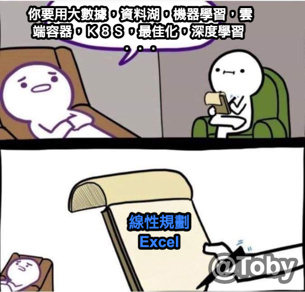

# 資料科學家或數據分析師的工作流程

## 動機

我們為何要當資料科學家
* 我們對於分析事物很有興趣
* 薪水: 當資料科學家的薪水不錯  
不過也需要你是一個優秀的軟體工程師，通常基本技能要熟悉 python 與 R ，加分項目包含前端(javascript, React, Vue等)，後端(Node.js, java 等)與容器化技術，CICD等。

## 工作流程

1. 問題、目的 釐清與認識  
如果大家有出來工作過就會發現一將無能累死三軍，
常常你的長官需求亂變，
工作亂給，
什麼都在變，
但是開發時間是不會變的這是鐵律，
我們做數據科學家要幫你的長官或更上級的長官，
我們要循循善誘的引導他們，
因為他們腦袋常常一團糨糊不清楚自己要什麼，
我們來舉個例子，我有碰過一個要求"聽到叫聲判斷是哪種動物，是不是保育動物"。
以老闆的角度，我開發出來這功能就可以去賣錢，有噱頭就可以。 
下面我們以資料科學家與工程師的角度來看這個問題，
我們的收音設備可以收到多少分貝多清晰的聲音，
我們的設備會不會被其他干擾，
是指向還是環繞(你可能會想問這有關西嗎)，
因為我們是要做叫聲去做分類，
所以我們要收集動物叫聲收集，
我們要考慮要收集那些動物的叫聲(老的小的雄的雌的，不同地區不同季節的叫聲有差嗎等等)，
我們的收音設備跟使用者的收音設備有差嗎，
工程要考慮我們的模型可況展性，可替換性，
我們是自己開發設備或是用別人的系統，
有網路嗎等等問題，
老闆都會以為我付你薪水這些你自己都要搞定，
但是難道你會為了區區幾個臭錢拿你的iphone去找獅子老虎大熊反覆橫跳，
去引他們亂叫，然後讓家人幫你收屍嗎，
有些工作會把數據收集，數據清理等都算是你的工作，還沒獎金，
他們覺得這是你分內之事，
所以一開始的問題與目的釐清，
讓上面知道要有初步效果要花的時間與人力有多少，
還有市面上競爭的產品有哪些，
以目前研發的工程師與資料科學家開發出來在市面上的優劣勢分析，
如果你沒有做過事前的完整規劃，
你會體會到長官與老闆的奇思妙想與天馬行空，
你出來工作會發現一推只會動嘴，
只有一張嘴其他什麼事都不會做的人，
叫別人做事說一堆，要他做事就是我不會，這不關我的事，
很多秘辛以後再來多說說。

2. 資料的獲取  
根據要分析的問題，我們要收集數據，如果要做監督學習(supervise learning)，我們還要清楚要什麼樣的紀錄，什麼樣的格式。  
下面舉個例子: 掀背車

  
假設你要出一個模型去分類不同的車子，那你為了要教會模型分辨車子的種類，你會找人在大馬路上，各地點拍了一堆影片，你會想要標記他的車子類型，但是你會發現，有很多模糊的地方，可能是車子的造型很特殊，或是他角度本來就很奇特，在決定要獲取什麼資料，與資料格式都是一個很麻煩的事，更嚴謹來說，現在會把資料也上版本，不光程式有版本，單元測試(unit test)有版本，連資料數據也要上版本。

3. 數據整理 與 數據清理  
我們收的原始數通常是有很多問題的，例如 數據有缺失，格式不統一，或是沒有代表性等等。  
這邊舉個例子為何有格式不統一的問題，假設我們要 "無" 這件事，有的人是用 0, null, 空格, 等等，這最常發生在有一些年頭的公司，公司一定都是從無到有，從小長到大，一開始就沒有要做資料分析的規劃，一開始就是留個紀錄備檔，但是當精準行銷，數據分析等概念興起的時候，老闆就會開使聘人，想要爆發式的成長，想要讓停滯的業績有成倍的效果，但是老闆或你的長官也不知道怎麼做啊，但是公司最不缺的就是垃圾數據，有銷售數據，有業務留下的充滿個人風格的excel或是word紀錄文件，比較大的公司有建系統建資料庫，不過你也會發現公司有一堆資料庫一堆系統，格式有些很複雜還對不上，或是要關聯很多次才會有你想要拿來分析的數據，老闆常見給的任務就是，我這裡有很多多數據，你不是做資料分析的嗎，拿去看可以分析出什麼，可以看出什麼，這時候你沒有比你老闆清晰的頭腦，你會連該怎麼開始都不知道，更不要說把一堆雜亂數據整理成為好分析的數據。

4. 資料分析 與 建立模型  
我們要根據不同的任務去挑選不同的模型與參數，這一部分我們會在以後詳細介紹，這一部分就是調模型，調參數的無限循環，也有人稱這階段叫煉丹。

5. 分析報告、可視化數據 或是 部屬上線
做好模型以後，就是讓上面有邀功的表現，你要知道長官與老闆完全不了解你花了多少努力，
那些模型他都完全不懂，所以你要用可視化的工具，
讓完全不懂的人都可以講出來，我們做了什麼(其實只有你在努力，老闆只負責出一張嘴負責叫你去做事)，
你還要預先幫你的長官想好台詞，因為他們完全不會知道你在幹嘛。  
等邀完工，你的老闆升職加薪，
就該你把你辛苦的成果上線部屬給測試部門去測試，
去回報你之前沒考慮的問題(例如 人把自己的叫聲拿變聲器改一改去測試是哪種動物)，
或是各種Bug等等，
等你都修到大家都沒問題就可以等上線。

# 人工智慧 Artificial Intelligence (AI)

我們來談談人工智慧的分類

人工智慧是最大的集合，機器學習是人工智慧的一個獨立分支，他是關於開發具有自我學習能力的演算法，也是這次課程我們主要關注的部分，
深度學習是現在很紅的項目，我們這堂課也會提到基礎的部分，更深的內容就期待以後有機會開課來教大家。 

人工神經元(artificial neuron)的定義是參考人類的神經元給的，我們下面來看看定義。

假設 $\phi$ 是一個人工神經元函數， $\phi$ 的輸入就是一串訊號 $(x_1, \cdots , x_n)$ ，
$\phi$ 的第一步會把訊號做加權，

$$
z= w_1 x_1 + \cdots + w_n x_n
$$

我們腦中也常常會自動忽略我們不在意的訊號(例如你老闆的叫聲)，也會自動加強你在意的訊號(例如你男女朋友的呼喚)。  
第二步就是根據這些訊號，我們要不要被激活，如果$z$大於例如$0.5$就被激活，小於$0.5$就不被激活，這其實就叫做邏輯回歸(logistic regression)我們以後會提到。  
深度學習就是把很多神經元疊起來去做分析判斷的技術。

# 機器學習

我們先來看看幾種類型的機器學習: 
* 監督學習 (supervised learning)
* 非監督學習 (unsupervised learning)
* 強化學習 (reinforcement learning)
* 半監督學習 (semi-supervised learning)
* 自監督學習 (self-supervised learning)

# Supervised Learning (監督學習)
## **定義**
所有的資料（訓練資料，驗證資料，測試資料）都被「標註」(label)，告訴模型相對應的值，以提供機器學習在訓練模型，驗證模型時判斷預測與標註的差異。

## **更多的碎碎念**
你知道機器學習（Machine Learning）可以分學幾類嗎？根據資料被標記的狀態可以分為下面幾種
* 監督式學習 (Supervised Learning)  
監督學習通常分為分類與回歸兩類問題，我們之後要講的好用工具 scikit-learn 
常見算法有決策樹（Decision Tree， DT）、支持向量機（Support Vector Machine， SVM）和神經網絡等。
* 非監督式學習 (Unsupervised Learing) 
* 增強式學習 (Reinforcement Learning)

我們在以後還會看到更多，例如自監督學習（Self-Supervised Learning）[參考範例](https://github.com/facebookresearch/dino)

[DINO Video](https://tobytoy.github.io/OpenResource/machine-learning(scikit-learn)/images/Self-attentionVideo.mp4 "Title")

我們下面來說點人話

什麼是監督學習啊，就是填鴨式教育，假設我們要讓電腦學會判斷貓跟狗。

我們要準備很多圖片裡面有貓貓跟狗狗，並且跟電腦說這張圖片是貓貓，那張圖片是狗狗。

所以監督學習重點要電腦學會什麼？

沒錯就是預測，可能要學會預測貓狗或是股票漲跌等等。

# Scikit Learn

scikit learn 是現在最流行的機器學習套件之一， scikit learn 是基於 SciPy, Numpy 等 python套件建構的用於機器學習的 Python 套件。

* [官網](https://scikit-learn.org/stable/index.html)
* [中文翻譯](https://scikit-learn.org.cn/)

下面一張圖是 scikit learn 作弊小抄。

[來源](https://scikit-learn.org/stable/tutorial/machine_learning_map/index.html)

我們之前已經介紹機器學習的大致任務分類，Supervised Learning 監督學習，Unsupervised Learning 非監督學習。

那在 scikit learn 裡面可以分為四大項目 classification 分類，clustering 聚類，regression 迴歸，dimensionality reduction 降維。

這邊有兩個名詞 classification 分類，clustering 聚類 有人知道其中的差別嗎?

下面就來解說一下這四大類。

1. Classification:  
  如果我們的訓練資料有標記要拿來分類，則這種任務就是 Classification 。
2. Clustering:  
  如果我們的訓練資料有一堆，但是沒標記，要做的是unsupervised learning，做聚類分堆問題，則這種任務就是 Clustering 。
3. Regression:  
  如果要做的分類不是離散，是連續的，立如要預測股價，房價等等，這種任務就是Regression。
4. Dimensionality reduction:  
  如果資料的維度太多，可以利用 scikit learn 裡面的方法來降維，例如 PCA 。
  

# 基本流程

我們下面來談談機器學習的訓練流程，下面的流程是監督學習的流程，監督學習的學習方法跟我們在補習班學習的填鴨式學習非常像。

# Baseline Model

基本模型就是最基本的模型，可以是平均或是固定值。
為什麼我們要有 Baseline Model?

