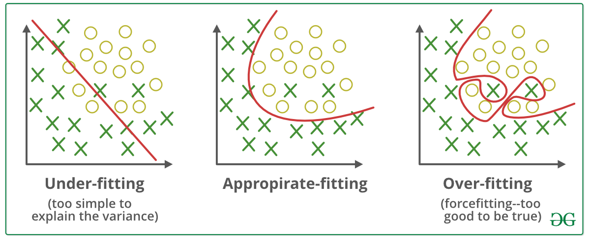
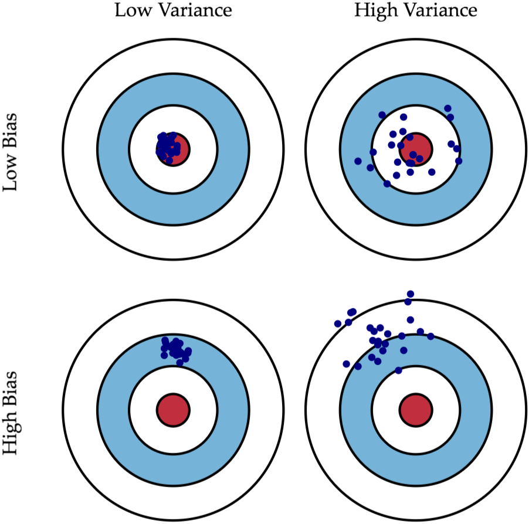
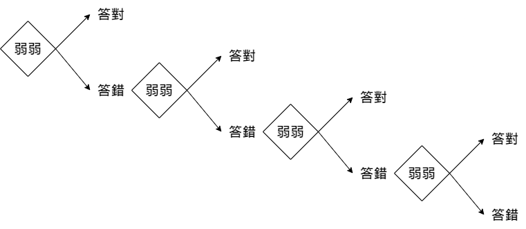

# 簡介
我們先來看看 Scikit learn 提供哪些資料"玩具資料集"，
為什麼稱為玩具資料，因為實際處理的資料格式不會這麼統一，可能會有缺失資料。
在開始訓練模型之前有一份工作叫做 data cleaning 資料清洗，要把實際收到的資料格式統一，把缺失資料補上等等操作。
而玩具資料的特點一是資料量不多，特點二是格式都統一也沒有缺失資料，非常適合用來學習機器學習。


# Iris plants dataset. 鳶尾植物數據集

一次看太多會失去樂趣，我們先來看這個資料集。

* Number of Instances: <font color=#0000FF>$50$</font> <br>
  這個資料集有 $50$ 筆資料。
* Number of Attributes: 4 <br>
  每筆資料有 $4$ 個特徵。


## Attributes 特徵分別是
我們來英文翻譯，花萼（sepal）和花瓣（petal），長度（length）和寬度（width）。

1. sepal length in cm， 花萼 的 長度。
2. sepal width in cm， 花萼 的 寬度。
3. petal length in cm， 花瓣 的 長度。
4. petal width in cm， 花瓣 的 寬度。


## Class
要分類的是鳶尾花屬下的三個亞屬，分別是山鳶尾（setosa）、變色鳶尾（verscicolor）和維吉尼亞鳶尾（virginica）。

1. Setosa， 山鳶尾
2. Versicolour， 變色鳶尾
3. Virginica， 維吉尼亞鳶尾


```python 
# 得到資料 方法一: 直接得到 X, y 
from sklearn import datasets

X, y = datasets.load_iris(return_X_y=True)

print('The shape of X: ', X.shape, ' The shape of y: ', y.shape)

```


```python 
import pandas as pd
X_df = pd.DataFrame(X)
X_df.describe()
```


```python 
# 得到資料 方法二: 先拿到資料物件，再得到 X, y
from sklearn import datasets

data = datasets.load_iris()

print('The data features:')
display(data.feature_names)

X = data.data
print('The shape of X: ', X.shape, '\n')

print('The class names:')
display(data.target_names)

y = data.target
print('The shape of y: ', y.shape)

```


# Diabetes dataset. 糖尿病數據集

* Number of Instances: <font color=#0000FF>$442$</font> <br>
  這個資料集有 $442$ 筆資料。
* Number of Attributes: 10 <br>
  每筆資料有 $10$ 個特徵。


## Attributes 特徵分別是

1. age in years， 年紀。
2. sex， 性別。
3. bmi body mass index。
4. bp average blood pressure。
5. s1 tc, total serum scholesterol
6. s2 ldl, low-density lipoproteins
7. s3 hdl, high-density lipoproteins
8. s4 tch, total cholesterol / HDL
9. s5 ltg, possibly log of serum triglycerides level
10. s6 glu, blood sugar level


```python 
# 直接得到 X, y 
from sklearn import datasets

X, y = datasets.load_diabetes(return_X_y=True)
print('The shape of X: ', X.shape, ' The shape of y: ', y.shape)


```


當我們需要更大量的資料來測試的時候，我們可以使用 scikit learn 的 Generated datasets 來隨機生成我們想要的數據。


# Generated datasets 生成的數據集

* make_blobs
* make_classification
* make_gaussian_quantiles
* make_biclusters
* make_blobs
* make_checkerboard
* make_circles
* make_classification
* make_friedman1
* make_friedman2
* make_friedman3
* make_gaussian_quantiles
* make_hastie_10_2
* make_low_rank_matrix
* make_moons
* make_multilabel_classification
* make_regression
* make_s_curve
* make_sparse_coded_signal
* make_sparse_spd_matrix
* make_sparse_uncorrelated
* make_spd_matrix
* make_swiss_roll


我們下面簡單來看 make_classification 的用法。


```python 
# 直接得到 X, y 
from sklearn import datasets

X, y = datasets.make_classification(n_samples=1000, n_features=4)

```


下面我們會開始準備你的第一戰，
我們先準備資料


```python 
from sklearn import datasets

X, y = datasets.load_iris(return_X_y=True)

print('The shape of X: ', X.shape, ' The shape of y: ', y.shape)

```


我們先準備基準模型 (baseline model)，假設我們無腦猜1。


```python 
count = 0
for flag in y == 2:
    if flag:
        count += 1

print('答對 ', count, '題，準確率: ', count/len(y))


# 以後會教的比較高級 baseline model 使用方法
from sklearn.dummy import DummyClassifier
baseline_model = DummyClassifier(strategy='constant', constant=1, random_state=87)
baseline_model.fit(X, y)

baseline_model.score(X, y)


```


我們先來切分資料


```python 
# 切分資料
X_train = X[:-30]
X_test  = X[-30:]

y_train = y[:-30]
y_test  = y[-30:]

```


我們下面展示一下流程，不用太在意模型的原理我們之後會詳細解釋。


```python 
from sklearn import svm

C = 1.0  # SVM regularization parameter
models = (
    svm.SVC(kernel="linear", C=C),
    svm.LinearSVC(C=C, max_iter=10000),
    svm.SVC(kernel="rbf", gamma=0.7, C=C),
    svm.SVC(kernel="poly", degree=3, gamma="auto", C=C),
)

models = (clf.fit(X_train, y_train) for clf in models)

```


我們來看看訓練完的模型效果如何，我們可以檢討一下切分資料為何不好，我們可以列印出 $X$ 與 $y$ 的資料來看看。


```python 
from sklearn.metrics import accuracy_score

for clf in models:
    y_pred = clf.predict(X_test)
    print(accuracy_score(y_test, y_pred))
    
    
```


好像還可以，我們下面介紹一種常用的切分資料的方法，稱為Holdout Method，切為 train ， test 集合，我們在以後cross-validation的章節會詳細介紹其他方法，我們現在就先來試試他的威力八。


```python 
from sklearn.model_selection import train_test_split

X_train, X_test, y_train, y_test = train_test_split(X, y, test_size=0.2, random_state=87)

```


```python 
from sklearn import svm

C = 1.0  # SVM regularization parameter
models = (
    svm.SVC(kernel="linear", C=C),
    svm.LinearSVC(C=C, max_iter=10000),
    svm.SVC(kernel="rbf", gamma=0.7, C=C),
    svm.SVC(kernel="poly", degree=3, gamma="auto", C=C),
)

models = (clf.fit(X_train, y_train) for clf in models)

```


```python 
from sklearn.metrics import accuracy_score

for clf in models:
    y_pred = clf.predict(X_test)
    print(accuracy_score(y_test, y_pred))


```


恭喜你完成人生的第一場戰鬥，下面我們要介紹一些很重要的概念，```over fitting``` 跟 ```under fitting```。





你已經完成人生的第一場戰鬥，但是打鐵要趁熱，我們先來說說妳以後訓練模型可能會碰到的問題，
模型的錯誤可以簡單分為 Bias 與 Variance的大小，我們以後會介紹ensemble方法，
我們看完下面的圖就可以理解ensemble的投票(voting)與平均(mean)為何可以增加模型的準度，
但是我在這邊也要潑一下冷水，在實務上除非你做的模型沒有時間壓力，
不然通常不會採用 ensemble 強化你的模型的準確度。





## Ensemble
下面來簡單介紹 ensemble 的方法，可以分為兩大類

- 平均法 averaging methods <br>
例如我們可以訓練許多中型的模型 (Low Bias)，然後讓他們投票，
就有可能給出 Low Bias 跟 Low Variance 的更好的模型。

- 提升法 boosting methods <br>
我們還有另一個思路，三個臭皮匠勝過一個諸葛亮，我們一個打不過，可以不講武德車輪戰一個一個上阿，
每次進步一點，那多輪以後就有一個強大的模型。 <br>
下面舉個例子，假設我們要做的問題是二分類問題，如果隨便猜，猜對的機率因該是 $1/2$，
假設我們有一個方法可以比亂猜的機率高一點，假設是 $1/2 + 0.00001$，
那我們可以給他好幾關。




```python 
# 可以答對的機率
q = 0.5 + 0.00001
# 錯誤的機率
err_rate = 1 - q

for i in range(10):
    print('第 ', i+1, ' 次答對機率: ', 1 - err_rate)
    err_rate = err_rate * (1-q)

```


### 總結

平均法(例如 voting 或 bagging)對於每個強大與複雜的模型還要在更進一步的提升非常有效，
也可以緩解 over fitting 等問題，但是如果拿來平均的模型有老鼠屎，
ensemble 的模型會不升反降，
提升法去整合弱模型有良好的表現。


