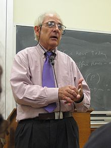

[source](https://dahetalk.com/2018/04/08/%E5%AE%8C%E6%95%B4%E8%A7%A3%E6%9E%90ai%E4%BA%BA%E5%B7%A5%E6%99%BA%E6%85%A7%EF%BC%9A3%E5%A4%A7%E6%B5%AA%E6%BD%AE%EF%BC%8B3%E5%A4%A7%E6%8A%80%E8%A1%93%EF%BC%8B3%E5%A4%A7%E6%87%89%E7%94%A8%EF%BD%9C/)


# 人工智慧 Artificial Intelligence (AI)

- 人工智慧 是指由人製造出來的機器所表現出來的 ```智慧```。
- 智慧是哲學問題。

## 什麼是智慧

John Rogers Searle 美國哲學家

- 強人工智慧
強調電腦將能擁有自覺意識、性格、情感、知覺、社交等人類的特徵。

- 弱人工智慧
主張機器只能模擬人類具有思維的行為表現，而不是真正懂得思考。他們認為機器僅能模擬人類，並不具意識、也不理解動作本身的意義。

- Example : 烏鴉跟鸚鵡

## 計算機科學與人工智慧之父


- 2014年的電影《模仿遊戲》
- 機器會思考嗎？
- 圖靈測試

## 人工智慧的方向

- 人工智慧的研究歷史有著一條從以「推理」為重點，到以「知識」為重點，再到以「學習」為重點的自然、清晰的脈絡。


# AI History

## 第一次人工智慧的黃金年代 1956 ~ 1974

- 1955年，全世界第一個人工智慧程式之稱的邏輯理論家 (Logic Theorist)
- 1958年，十年之內，數字計算機將成為西洋棋世界冠軍。(1997 IBM 深藍電腦打敗當時西洋棋世界冠軍)
- 1965年，二十年內，機器將能完成人能做到的一切工作。
- 1967年，一代之內，創造『人工智慧』的問題將獲得實質上的解決。
- 1970年，在三到八年的時間裡我們將得到一台具有人類平均智能的機器。

## 第一次 AI 的低谷 1974 ~ 1980

- 人類不知，機器也不能解決，AI這時沒超過人類。
- 對人工智慧的研究方向局限於邏輯數學領域、加上硬體環境上的困境，使早期人工智慧只能解一些代數題和數學證明，難以在實務上有所應用。


## 第二次人工智慧再次繁榮 1980 ~ 1993

- 「機器學習」是一門涵蓋電腦科學、統計學、機率論、博弈論等多門領域的學科，從 1980 開始蓬勃興起。
- 第一次人工智慧泡沫後，研究領域轉為「機器學習」(Machine Learning)。
- 機器學習之所以能興起，也歸功於硬體儲存成本下降、運算能力增強 (包括本機端與雲端運算)，加上大量的數據能做處理。

## 深度學習的低谷 1993 ~ 2010

- 早在 1943 年提出「MCP神經元」用來描述一個簡化的腦細胞。
- 淺層的機器學習模型。
- GPU沒出來，運算能力不行，數據不夠多。
- 1990年，支撐向量機 (SVM, Support Vector Machines)廣受歡迎，我們之後也會詳細介紹 SVM 。


## 再次爆發人工智慧的熱潮 2012~

- ImageNet 是全世界最大的圖像識別資料庫。每年，史丹佛大學都會舉辦 ImageNet 圖像識別競賽，參加者包括了Google、微軟、百度等大型企業，除了在比賽中爭奪圖像識別寶座、同時測試自家系統的效能與極限。
- 其實從 2007 年 ImageNet 比賽創辦以來，每年的比賽結果、每家都差不多，錯誤率大致落在 30%、29%、28%… 瓶頸一直無法突破。
- 結果 2012 年 Hinton 的兩個學生以 SuperVision 的隊伍名參賽，以16.42% 的錯誤率遠勝第二名的 26.22%。用的正是深度學習技術。


