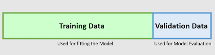

今天要介紹幾種常見的 cross-validation 的方法

* Holdout
* K-fold
* Leave one out and leave p out


假設我們拿到一組資料，我們已經學過很多模型去訓練，
我們會立刻發現我們有很多方法去建立模型去擬合這組資料，
但是這不一定表示表現越好的模型就是真的越好，
在以前我們就有談到過擬合（over fitting）的問題，
假設我們有兩組資料，一組叫訓練資料（training data），
一組叫驗證資料（validation data），我們不把驗證資料拿來訓練，
這樣我們是不是就可以選到最好的模型，答案也不是這樣，
假設我們來來玩猜數字遊戲，1到100，我心中想一個數字，你可以一直猜我只回答對跟錯，
你猜的夠多次，還是可以猜到正確答案，所以我們會需要第三類測試資料（test data），
但是我們不會頻繁的一直使用測試資料以防測試資料的訊息洩漏給模型知道。


# Holdout

第一個我們很直覺的想法就是，把資料切一部分拿來做測試資料 （test data），我們可以看一下下面的使用範例。

在很多 scikit-learn 提供的機器學習方法不會非常頻繁的拿測試資料去驗證，所以你可以看到 **train_test_split**，
但是像在做 deep learning 在找最佳化的步驟的時候或是使用SGD的時候會頻繁的拿測試資料去驗證，
這時後比較合裡的做法是把訓練資料再切一份出來做驗證資料（validation data）。





```python 
from sklearn import datasets
from sklearn.model_selection import train_test_split

X, y = datasets.load_iris(return_X_y=True)

X_train, X_test, y_train, y_test = train_test_split(X, y, test_size=0.2, random_state=87)

```


# K-fold

下面介紹 K-fold 的方法，假設 $k=5$，
所有的資料也是先切 training data 與 test data，
再來把 training data 切 5 份，
留一份（Leave One Out）拿來驗證，其他拿去訓練模型，
你一定可以立刻想到那我可以留更多份嗎? 答案是可以的就是 （Leave p Out）。


```python 
import numpy as np
from sklearn.model_selection import LeaveOneOut
from sklearn.model_selection import LeavePOut

# Leave one out = K-Fold
print('Leave one out:')
X = [1, 2, 3, 4]
loo = LeaveOneOut()
for train, test in loo.split(X):
    print("%s %s" % (train, test))

# Leave p out 當 p 大於 1，驗證與訓練資料會混在一起。
print('Leave p out:')
lpo = LeavePOut(p=2)
for train, test in lpo.split(X):
    print("%s %s" % (train, test))


```


下面繼續看 K-Fold 怎麼驗證


```python 
# 一次看一個 score
from sklearn.model_selection import cross_val_score
from sklearn import datasets
from sklearn import svm

X, y = datasets.load_iris(return_X_y=True)

classifier = svm.SVC(kernel='linear', C=1, random_state=87)
scores = cross_val_score(classifier, X, y, cv=5)
#scores = cross_val_score(classifier, X, y, cv=5, scoring='f1_macro')  # 重要我們可以搭配 不同的metrics
scores

```


```python 
# 一次看多個 score
from sklearn import datasets
from sklearn import svm
from sklearn.model_selection import cross_validate


X, y = datasets.load_iris(return_X_y=True)

scoring = ['precision_macro', 'recall_macro', 'accuracy'] # 重要我們可以搭配 不同的metrics

classifier = svm.SVC(kernel='linear', C=1, random_state=0)
scores = cross_validate(classifier, X, y, cv=5, scoring=scoring)
# scores = cross_validate(classifier, X, y, scoring=scoring, return_estimator=True)  # 如果想要得到在每個訓練集上模型


#sorted(scores.keys())

scores

```


```python 
# scikit learn 提供可以使用的 metrics
from sklearn import metrics

metrics.SCORERS.keys()

```


# cross_val_predict

可以根據 cross validation 去給出標籤預測。


# cross_val_score

給出分數的平均。


```python 
from sklearn import datasets
from sklearn import svm

from sklearn.model_selection import cross_val_predict, cross_val_score


X, y = datasets.load_iris(return_X_y=True)


classifier = svm.SVC(kernel='linear', C=1, random_state=0)


_ = cross_val_predict(classifier, X, y, cv= 5)
print('Predict:')
print(_)


_ = cross_val_score(classifier, X, y, cv= 5)
print('Score:')
print(_)

```
